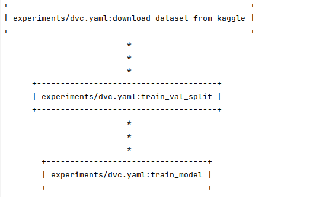

# EmoScan

Репозиторий обучения модели классификации эмоций лица.

[Использование модели](https://github.com/starminalush/mfdp-2023-mvp/)

Используемые датасеты
---------------------

<a target="_blank" href="https://www.kaggle.com/datasets/noamsegal/affectnet-training-data">AffectNet</a>

<a target="_blank" href="https://www.kaggle.com/datasets/msambare/fer2013">Fer2013</a>

## DVC pipeline

## Эксперименты

| Модель | Датасет | git tag | F1 мера | Latency (batch=1) | Throughtput (batch=5) | Вывод |
| --- | --- | --- | --- | --- | --- | --- |
| pretrained ResNet18 | FER2013 |  v1.0 | 0.67 | 0.012 | 918.7 | Получен бейзлайн |
| pretrained ResNet18 | AffectNet-8 |  v1.1 | 0.70 | 0.011 | 916.6 | Улучшение качества и незначительное ухудшение пропускной способности|
| pretrained ResNet18 | AffectNet-7 |  v1.2 | 0.712 | 0.013 | 913.9 | Улучшение качества и  незначительное ухудшение пропускной способности|
| **pretrained DAN(RafDB)** | AffectNet-7 |  v1.3 | 0.718 | 0.018 | 524.9 | Улучшение качества и  незначительное ухудшение времени инференса. Сильное время ухудшения пропускной способности, но все еще приемлимое|
| pretrained mobilenet_v3_small | AffectNet-7 |  v1.4 | 0.412 | 0.02 | 1254.1| Качество стало хуже. Мердж в мастер отклонен|

## Переменные окружения

| Переменная            |                                 Описание                                 |   Значение по умолчанию   |
|-----------------------|:------------------------------------------------------------------------:|:-------------------------:|
| AWS_ACCESS_KEY_ID     |                            ACCESS_KEY для s3                             |         miniokey          |
| AWS_SECRET_ACCESS_KEY |                            SECRET_KEY для s3                             |       minisecretkey       |
| MINIO_PORT            |                      Порт для внешнего доступа к s3                      |           9001            |
| AWS_ENDPOINT_URL      |                    s3  endpoint url для настройки dvc                    |     http://minio:9000     |
| MINIO_BUCKET          |               Имя бакета, куда dvc будет сохранять данные                |           mfdp            |
| POSTGRES_USER     |                       Пользователь базы для mlflow                       |         postgres          |
| POSTGRES_PASSWORD |                   Пароль пользователя базы для mlflow                    |     mysecretpassword      |
| POSTGRES_DB     |                          База данных для mlflow                          |          mlflow           |
| POSTGRES_HOST |                              Хост postgres                               |         postgres          |
| POSTGRES_PORT |                              Порт postgres                               |           5432            |
 | MINIO_MLFLOW_BUCKET |            Бакет s3 для хранения артефактов запуска обучения             |        experiments        |
| MLFLOW_EXTERNAL_PORT |            Порт для внешнего доступа к веб-интерфейсу mlflow             |           5000            |
| MLFLOW_TRACKING_URI| Адрес сервиса mlflow. Необходим для логирования результатов при обучении | http://mlflow_server:5000 |
| MLFLOW_S3_ENDPOINT_URL|  Адерс с3 сериса mlflow. Необходим для логирования результатов обучения  |     http://minio:9000     |
|KAGGLE_USERNAME|            Имя пользователя на kaggle для скачивания датасета            | some kaggle username here |
|KAGGLE_KEY|       Ключ пользователя kaggle. Тоже нужен для скачивания датасета       |   some kaggle key here    |
|DEVICE|              Девайс, на котором будет запускаться обучение               |          cuda:0           |

## Запуск обучения 

### Локальный запуск.

1. Заполните .env файл в корне проекта по примеру .env.template.
2. Создайте конфиг по примеру файла experiments/configs/fer/train.yaml. Укажите импорты для нужных модулей.
3. Создайте виртуальное окружение и установите в него зависимости из файла requirements.txt. 
4. Настройте подключение к dvc и загрузите сабмодули запуском команды:
   `make all`
5. Запустите контейнеры для mlflow:
   `sudo docker compose up --build -d mlflow_server`. Контейнеры, необходимые для работы этого контейнера, поднимутся самостоятельно.
5. Выполните команду:

   `dvc repro experiments/dvc.yaml`

### Запуск в docker
Вы также можете запустить обучение в docker. Для этого вам необходимо:
1. Выполнить шаги 1-2 локального запуска.
2. Выполнить команду 
   `sudo docker compose up --build -d`
чтобы поднять все контейнеры и начать обучение.

## Конвертация модели
На данный момент доступна только конвертация модели в ONNX. Чтобы это сделать, запустите скрипт experiments/converters/torch_to_onnx.py. Модель автоматически будет добавлена в mlflow, и ее можно будет подгружать в другие сервисы.

